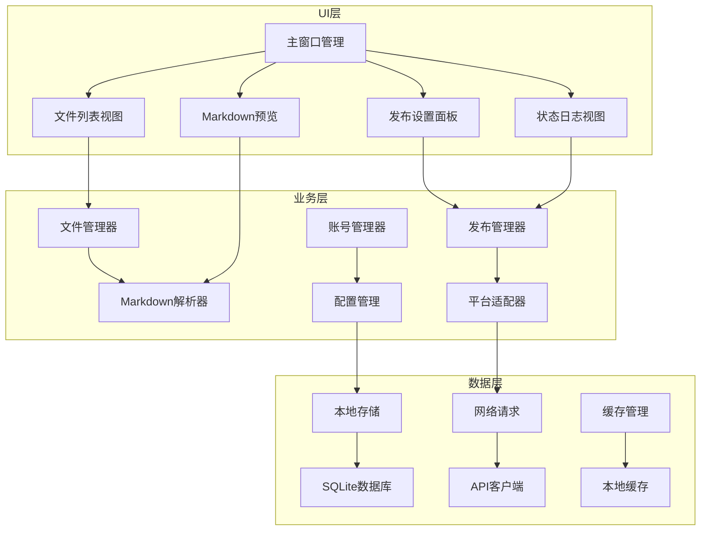

# MarkPub

<div align="center">
    
    <h3>一键发布 Markdown 文章到多个博客平台</h3>
</div>


## 📖 项目简介

MarkPub 是一款现代化的桌面应用程序，专注于简化 Markdown 文章的发布流程。它支持将 Markdown 文档一键发布到多个主流博客平台（如 CSDN、掘金等），提高内容创作者的工作效率。

### ✨ 主要特性

- 🚀 一键发布到多个平台
- 📝 Markdown 实时预览
- 🎨 现代化界面设计（类 VSCode）
- 🌗 支持亮色/暗色主题
- 📦 批量文章管理
- 🔄 自动同步功能（计划中）

## 🏗️ 系统架构



## 🛠️ 技术栈

### 后端技术
- Python 3.x：核心开发语言
- requests/httpx：API 请求处理
- markdown/mistune：Markdown 解析
- sqlite3：本地数据存储
- playwright/selenium：模拟登录支持

### 前端技术
- PyQt6/PySide6：GUI 框架
- QWebEngineView：Markdown 预览
- QDarkStyle/Qt Material：主题样式

## 📦 安装使用

### 环境要求
- Python 3.8+
- pip 20.0+

### 安装步骤

1. 克隆仓库
```bash
git clone https://github.com/yourusername/markpub.git
cd markpub
```

2. 安装依赖
```bash
pip install -r requirements.txt
```

3. 运行应用
```bash
python main.py
```

## 🖥️ 界面预览

### 主界面


### 设置界面


## 📝 使用说明

1. **文章管理**
   - 拖拽或选择 Markdown 文件
   - 支持批量导入
   - 文件实时预览

2. **发布设置**
   - 选择目标平台
   - 设置文章分类和标签
   - 编辑文章摘要

3. **账号配置**
   - API Key 认证
   - Cookie 登录
   - 多账号管理

4. **发布操作**
   - 一键发布
   - 发布状态追踪
   - 历史记录查看

## 🗺️ 开发路线

- [x] 基础框架搭建
- [x] Markdown 解析与预览
- [x] CSDN 平台支持
- [x] 掘金平台支持
- [ ] 知乎平台支持
- [ ] 微信公众号支持
- [ ] 自动同步功能
- [ ] 富文本编辑器

## 🤝 贡献指南

欢迎贡献代码或提出建议！请查看 [CONTRIBUTING.md](CONTRIBUTING.md) 了解更多信息。

## 📄 许可证

本项目采用 [MIT 许可证](LICENSE)。

## 👥 联系我们

- 项目主页：[GitHub](https://github.com/yourusername/markpub)
- 问题反馈：[Issues](https://github.com/yourusername/markpub/issues)
- 邮件联系：your.email@example.com

## 🙏 致谢

感谢所有为本项目做出贡献的开发者！ 